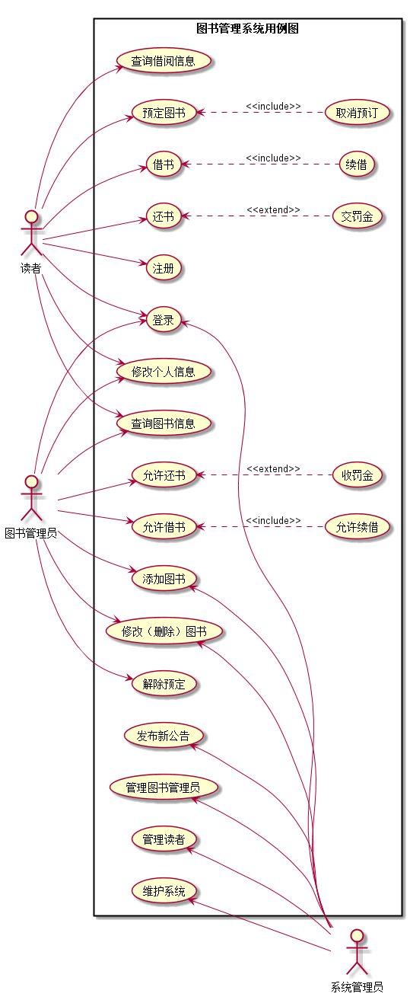

# 实验2：图书管理系统用例建模
|学号|班级|姓名|照片|
|:-------:|:-------------: | :----------:|:---:|
|201510414413|软件(本)15-4|梅恩||

## 1. 图书管理系统的用例关系图

### 1.1 用例图PlantUML源码如下：

``` usecase
@startuml
left to right direction
skinparam packageStyle rectangle
actor 读者 as d
actor 图书管理员 as t
actor 系统管理员 as x
rectangle 图书管理系统用例图{

    d --> (查询借阅信息)
    d --> (预定图书)
    (预定图书)<..(取消预订):<<include>>
    d --> (借书)
    (借书)<..(续借):<<include>>
    d --> (还书)
    (还书)<..(交罚金):<<extend>>
    d --> (注册)
    d --> (修改个人信息)
    d --> (查询图书信息)
    d --> (登录)

    t --> (修改个人信息)
    t --> (查询图书信息)
    t --> (登录)
    t --> (添加图书)
    t --> (修改（删除）图书)
    t --> (解除预定)
    t --> (允许还书)
    (允许还书)<..(收罚金):<<extend>>
    t --> (允许借书)
    (允许借书)<..(允许续借):<<include>>

    (发布新公告) <-- x
    (管理图书管理员) <-- x
    (管理读者) <-- x
    (维护系统) <-- x
    (登录) <-- x
    (添加图书) <-- x
    (修改（删除）图书) <-- x
}
@enduml
```


### 1.2. 用例图如下：



## 2. 参与者说明：

###     2.1 图书管理员

```
主要职责：
（1）严格执行图书管理的规章制度，保证图书馆的秩序不被破坏。
（2）具有完善的图书登记，包括读者借出图书时间，归还时间，是否超时罚款以及其他的特殊情况，提高图书流通率。
（3）有计划、有目的的选购图书，及时添购新书籍。
（4）图书馆的各种经费应该合理的规划和使用。
（5）添加，修改以及删除图书信息。
（6）做好图书馆的安全防护工作，特别是火灾预防。
（7）定期做好图书馆清洁。
```

###     2.2 读者

```
主要职责：
（1）借阅到的图书应该小心保护，不要损坏。
（2）图书借阅后，应该及时归还。
（3）图书馆图书不能二次外借，自己借自己用，养成良好习惯。
（4）图书遗失后，要主动罚款购买，不要逃避责任。
```

###     2.3 系统管理员
    
```
主要职责：
（1）增删改图书管理员信息
（2）增删改图书信息
（3）定期查看图书管理系统运行情况，保证运行无误
（4）发布公告等重要通知
（5）管理读者信息
```

##     3. 用例规约表

###     3.1 “借书和续借”用例规约

|用例名称|借书和续借|
|:-|:-|
|**参与者**|读者，图书管理员|
|**前置条件**|读者和图书管理员均登录到系统|
|**后置条件**|读者成功借阅到（续借到）图书|
|**主事件流**||
|**参与者动作**|**系统行为**|
|1.读者查阅所有的图书信息<br>3.读者选择目标书籍，并点击借阅（续借）<br>5.图书管理员允许借阅（续借）图书|2.系统显示图书信息<br>4.系统验证该用户是否能借阅（续借）图书<br>6.借阅成功，向数据库录入数据|
|**备选事件流**||
|**1a**、该读者没有借阅权限（可能是借阅数<br>量超过上限，或者是存在恶意借书不还情况）<br>&nbsp;&nbsp;&nbsp;&nbsp;1.系统提示没有借阅权限<br>**2a**、图书管理员没有点击确认<br>&nbsp;&nbsp;&nbsp;&nbsp;1.等待，直到点击确认为止<br>**3a**、图书已经被预定<br>&nbsp;&nbsp;&nbsp;&nbsp;1.系统提示该图书不能被借阅||
|**业务规则**||
|1、一个读者最多只能同时借阅5本书<br>2、一个读者同时只能预定3本书<br>3、借阅图书时间默认一个月，续借时间同上，<br>每本书最多被续借一次|

###     3.2 “查询图书信息”用例规约

|用例名称|查询图书信息|
|:-|:-|
|**参与者**|读者，图书管理员|
|**前置条件**|读者和图书管理员均登录到系统|
|**后置条件**|查询图书信息成功|
|**主事件流**||
|**参与者动作**|**系统行为**|
|1.读者或图书管理员点击查看图书信息<br>3.用户点击下一页<br>5.查看成功|2.系统获取图书信息并显示<br>4.系统获取下一页信息并显示<br>6.操作成功，流程结束|
|**备选事件流**||
|**1a**、用户没有登录到系统<br>&nbsp;&nbsp;&nbsp;&nbsp;1.系统提示用户需要先登录系统<br>**2a**、用户过快的点击下一页操作<br>&nbsp;&nbsp;&nbsp;&nbsp;1.一切情况按系统显示为准||
|**业务规则**||
|1、本系统需要先登录才能查看图书信息<br>2、读者和管理员权限不同，显示的内容随之改变|

###     3.3 “登录注册”用例规约

|用例名称|登录注册|
|:-|:-|
|**参与者**|读者，图书管理员，系统管理员|
|**前置条件**|参与者们都已经拥有账号|
|**后置条件**|成功登录（注册）|
|**主事件流**||
|**参与者动作**|**系统行为**|
|1.参与者输入账号密码点击登录<br>3.账号正确，登录成功<br>5.用户进行进一步操作|2.系统验证账号密码是否正确<br>4.系统根据角色权限跳转到对应首页<br>6.登录成功，流程结束（注册同上）|
|**备选事件流**||
|**1a**、参与者们忘记了登录密码<br>&nbsp;&nbsp;&nbsp;&nbsp;1.读者直接通过系统重置，管理员需要联系上层<br>||
|**业务规则**||
|1、只有读者需要进行注册操作<br>2、图书管理员由系统管理员分配<br>3、系统管理员由系统直接分配|

###     3.4 “还书和罚款”用例规约

|用例名称|还书（罚款）|
|:-|:-|
|**参与者**|读者，图书管理员|
|**前置条件**|读者和图书管理员均登录到系统|
|**后置条件**|读者成功还书（缴纳罚金）|
|**主事件流**||
|**参与者动作**|**系统行为**|
|1.读者查询借阅信息<br>3.读者选择目标书籍，并点击归还<br>5.如果超时读者则缴纳罚款|2.系统显示读者借阅信息<br>4.系统验证该用户归还的书籍是否超时<br>6.还书成功，流程结束|
|**备选事件流**||
|**1a**、读者还书时表示该书籍已经丢失<br>&nbsp;&nbsp;&nbsp;&nbsp;1.读者缴纳罚款购买该书籍<br>**2a**、读者还书时管理员发现书籍损坏严重<br>&nbsp;&nbsp;&nbsp;&nbsp;1.管理员视情况而自行处理||
|**业务规则**||
|1、超过还书日期，每天按0.1元计算<br>2、丢失了书籍应缴纳对应罚金购买该书籍<br>3、借阅图书时间默认一个月，续借时间同上，<br>每本书最多被续借一次|

###     3.5 “修改个人信息”用例规约

|用例名称|修改个人信息|
|:-|:-|
|**参与者**|读者，图书管理员|
|**前置条件**|读者和图书管理员均登录到系统|
|**后置条件**|修改个人信息成功|
|**主事件流**||
|**参与者动作**|**系统行为**|
|1.用户点击“个人信息”按钮<br>3.用户选中需要修改的信息，修改后提交<br>5.修改信息完成，退出系统|2.系统跳转到个人信息页面<br>4.该用户个人新信息录入数据库<br>6.退出系统成功，流程完成|
|**备选事件流**||
|**1a**、用户尝试修改不被允许修改的信息<br>&nbsp;&nbsp;&nbsp;&nbsp;1.系统提示该信息不允许被修改<br>**2a**、用户提交不被允许的特殊格式字符<br>&nbsp;&nbsp;&nbsp;&nbsp;1.系统提示格式错误<br>**3a**、用户修改后未提交就退出系统<br>&nbsp;&nbsp;&nbsp;&nbsp;1.系统忽略本次操作||
|**业务规则**||
|1、只能修改允许修改的字段信息<br>2、一定时间内仅能修改一次信息，避免恶意修改，增加服务器压力<br>3、某些信息仅能修改指定次数，用完后则不再能修改|

###     3.6 “预定图书”用例规约

|用例名称|预定图书（取消预定）|
|:-|:-|
|**参与者**|读者|
|**前置条件**|读者登录到系统|
|**后置条件**|读者成功预定（取消预订）图书|
|**主事件流**||
|**参与者动作**|**系统行为**|
|1.读者查阅所有的图书信息<br>3.读者选择目标书籍，并点击预定（取消预定）<br>5.操作被允许，读者预定（取消预订）操作成功|2.系统显示图书信息<br>4.系统判断是否能够预定图书<br>6.向数据库录入数据，流程结束|
|**备选事件流**||
|**1a**、图书库存不足或者都被预定了<br>&nbsp;&nbsp;&nbsp;&nbsp;1.系统提示不能预定图书<br>**2a**、读者达到允许借阅图书的上限<br>&nbsp;&nbsp;&nbsp;&nbsp;1.提醒用户仅能同时借阅5本书<br>**3a**、读者有不良借阅记录<br>&nbsp;&nbsp;&nbsp;&nbsp;1.系统提醒用户丧失了借阅资格||
|**业务规则**||
|1、一个读者最多只能同时借阅5本书<br>2、一个读者同时只能预定3本书<br>3、借阅图书时间默认一个月，续借时间同上，<br>每本书最多被续借一次|

###     3.7 “增删改图书”用例规约

|用例名称|增删改图书信息|
|:-|:-|
|**参与者**|系统管理员，图书管理员|
|**前置条件**|系统管理员和图书管理员均登录到系统|
|**后置条件**|图书信息修改成功|
|**主事件流**||
|**参与者动作**|**系统行为**|
|1.若是添加图书，则直接录入图书信息<br>3.用户点击查询图书信息<br>5.用户点击修改或删除图书|2.系统存储图书信息后显示操作成功<br>4.系统显示图书信息（包括新增的图书）<br>6.系统修改对应图书信息，提示操作成功<br>7.增删改图书成功，流程结束|
|**备选事件流**||
|**1a**、修改过成功意外退出系统，信息仅成功录入一半<br>&nbsp;&nbsp;&nbsp;&nbsp;1.系统删除新增内容，并在日志文档中记录<br>**2a**、用户删除图书后想还原信息<br>&nbsp;&nbsp;&nbsp;&nbsp;1.2小时以内进行的操作都允许被重置<br>**3a**、用户恶意的进行信息更改<br>&nbsp;&nbsp;&nbsp;&nbsp;1.系统进行的所有更改操作都需要3个以上的管理员确认后方可生效||
|**业务规则**||
|1、系统管理员能撤销图书管理员的操作，反之不行<br>2、图书管理员的操作需要被确认<br>3、在一定时间内进行的操作不能多于100条
