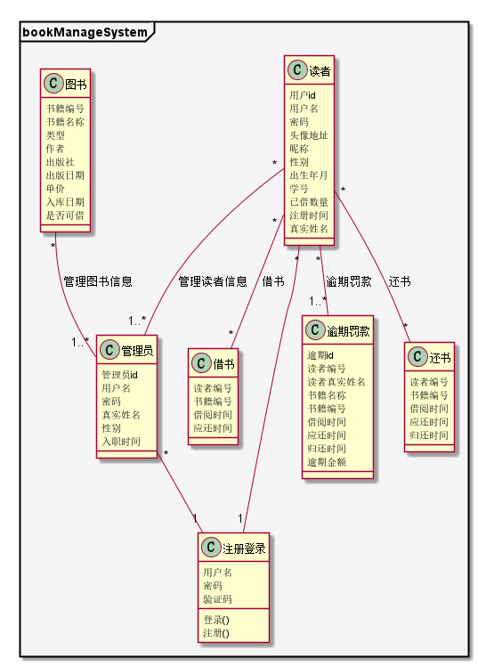
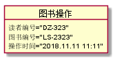
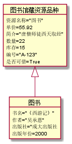
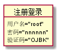
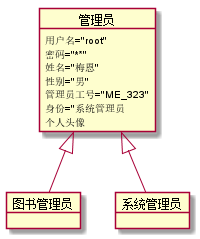
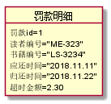
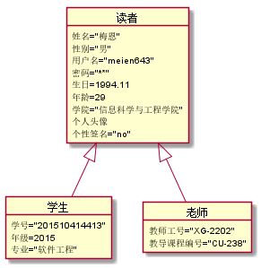

# 实验3：图书管理系统领域对象建模
|学号|班级|姓名|照片|
|:-------:|:-------------: | :----------:|:---:|
|201510414413|软件(本)15-4|梅恩||

## 1. 图书管理系统的类图

### 1.1 类图PlantUML源码如下：

``` class
@startuml
package bookManageSystem <<Frame>> #f5f5f5{
class 逾期罚款{
    逾期id
    读者编号
    读者真实姓名
    书籍名称
    书籍编号
    借阅时间
    应还时间
    归还时间
    逾期金额
}
class 还书{
    读者编号
    书籍编号
    借阅时间
    应还时间
    归还时间
}
class 借书{
    读者编号
    书籍编号
    借阅时间
    应还时间
}
class 注册登录{
    用户名
    密码
    验证码
    登录()
    注册()
}
class 读者{
    用户id
    用户名
    密码
    头像地址
    昵称
    性别
    出生年月
    学号
    已借数量
    注册时间
    真实姓名
}
class 管理员{
    管理员id
    用户名
    密码
    真实姓名
    性别
    入职时间
}
class 图书{
    书籍编号
    书籍名称
    类型
    作者
    出版社
    出版日期
    单价
    入库日期
    是否可借
}
    读者"*"--"*"借书:借书
    读者"*"--"*"还书:还书
    图书"*"--"1..*"管理员:管理图书信息
    读者"*"--"1..*"管理员:管理读者信息
    读者"*"--"1"注册登录
    管理员"*"--"1"注册登录
    读者"*"--"1..*"逾期罚款:逾期罚款
}
@enduml
```

### 1.2. 类图如下：



### 1.3. 类图说明：
```
（1）读者类为父类，其子类有学生和老师，他们公共的属性和方法抽象在读者类中，自身专有属性在自己类中体现。
（2）管理员类为父类，其子类有图书管理员和系统管理员
（3）图书馆藏资源品种为父类，图书仅为其一个子类。（因为图书馆可能还拥有除图书之外的藏品）
（4）管理员能对图书馆藏资源品种进行增删查改操作。
（5）管理员能对读者进行增删查改操作。
（6）读者能够进行图书操作。
（7）读者借阅书籍超时后需要进行罚款操作。
（8）图书馆藏资源品种被图书操作后，需要及时更新数据库。
```

## 2. 图书管理系统的对象图
### 2.1 类“图书操作”的对象图
#### 源码如下：
``` class
@startuml
object 图书操作{
    读者编号="DZ-323"
    图书编号="LS-2323"
    操作时间="2018.11.11 11:11"
}
@enduml
``` 
#### 对象图如下：


### 2.2 类“图书馆藏资源品种”的对象图
#### 源码如下：
``` class
@startuml
object 图书{
    书名="《西游记》"
    作者="吴承恩"
    出版社="成大出版社
    出版年份=2000
}
object 图书馆藏资源品种{
    资源名称="图书"
    单价=55.92
    简介="唐僧师徒西天取经"
    数量=22
    库存=15
    编号="A-123"
    是否可借=True
}
图书馆藏资源品种<|--图书
@enduml
``` 
#### 对象图如下：


### 2.3 类“注册登录”的对象图
#### 源码如下：
``` class
@startuml
object 注册登录{
    用户名="root"
    密码="nnnnnn"
    验证码="OJBK"
}
@enduml
``` 
#### 对象图如下：


### 2.4 类“管理员”的对象图
#### 源码如下：
``` class
@startuml

object 管理员{
    用户名="root"
    密码="******"
    姓名="梅恩"
    性别="男"
    管理员工号="ME_323"
    身份="系统管理员
    个人头像
}
object 图书管理员{

}
object 系统管理员{

}
管理员<|--图书管理员
管理员<|--系统管理员
@enduml
``` 
#### 对象图如下：


### 2.5 类“罚款明细”的对象图
#### 源码如下：
``` class
@startuml

object 罚款明细{
    罚款id=1
    读者编号="ME-323"
    书籍编号="LS-3234"
    应还时间="2018.11.11"
    归还时间="2018.11.22"
    超时金额=2.30
}

@enduml
``` 
#### 对象图如下：


### 2.6 类“读者”的对象图
#### 源码如下：
``` class
@startuml
object 学生{
    学号="201510414413"
    年级=2015
    专业="软件工程"
}
object 老师{
    教师工号="XG-2202"
    教导课程编号="CU-238"
}
object 读者{
    姓名="梅恩"
    性别="男"
    用户名="meien643"
    密码="******"
    生日=1994.11
    年龄=29
    学院="信息科学与工程学院"
    个人头像
    个性签名="no"
}
读者<|--学生
读者<|--老师
@enduml
``` 
#### 对象图如下：

