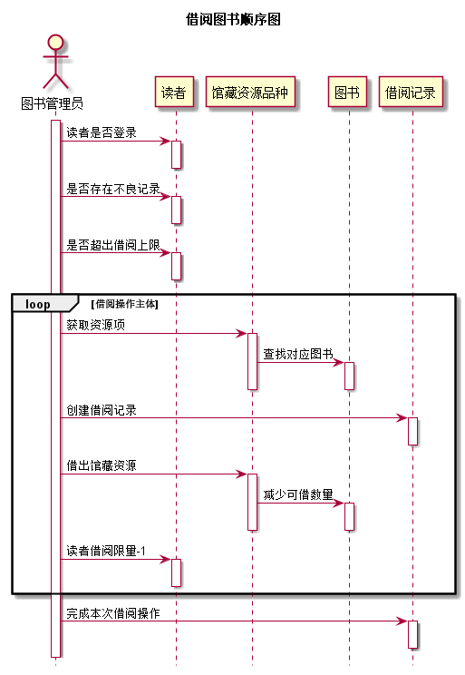
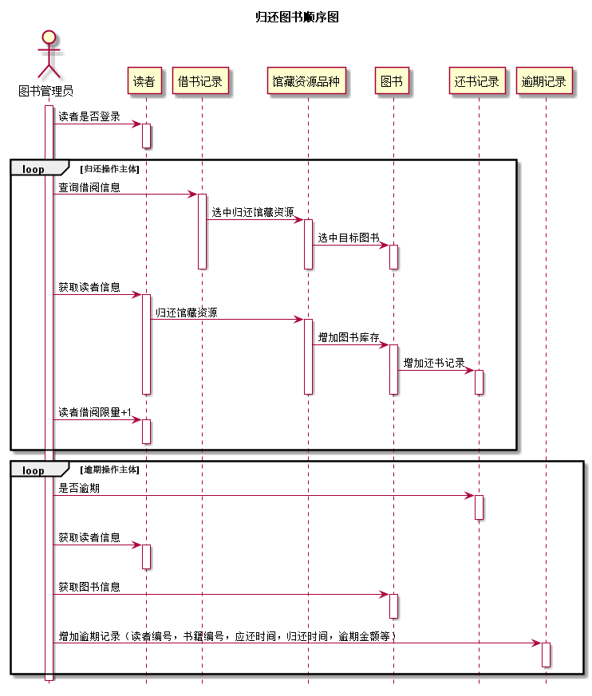
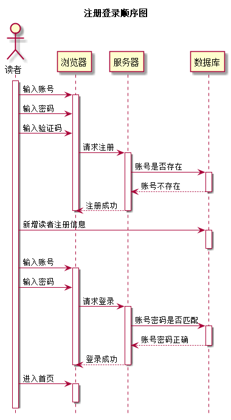
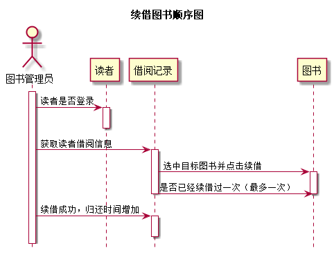
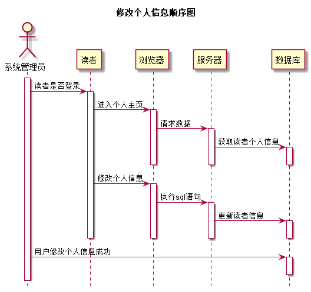

# 实验4：图书管理系统顺序图绘制
|学号|班级|姓名|照片|
|:-------:|:-------------: | :----------:|:---:|
|201510414413|软件(本)15-4|梅恩||

## 图书管理系统的顺序图

## 1. 借书用例
## 1.1. 借书用例PlantUML源码

``` sequence
@startuml
hide footbox
title 借阅图书顺序图
actor 图书管理员 as user
activate user
user->读者:读者是否登录
activate 读者
deactivate 读者
user->读者:是否存在不良记录
activate 读者
deactivate 读者
user->读者:是否超出借阅上限
activate 读者
deactivate 读者
loop 借阅操作主体
user->馆藏资源品种:获取资源项
activate 馆藏资源品种
馆藏资源品种->图书:查找对应图书
activate 图书
deactivate 图书
deactivate 馆藏资源品种
user->借阅记录:创建借阅记录
activate 借阅记录
deactivate 借阅记录
user->馆藏资源品种:借出馆藏资源
activate 馆藏资源品种
馆藏资源品种->图书:减少可借数量
activate 图书
deactivate 图书
deactivate 馆藏资源品种
user->读者:读者借阅限量-1
activate 读者
deactivate 读者
end
user->借阅记录:完成本次借阅操作
activate 借阅记录
deactivate 借阅记录
@enduml
```

## 1.2. 借书用例顺序图


## 1.3. 借书用例顺序图说明
```explain
借书用例顺序图步骤说明：
（1）系统先判断读者是否已经登录
（2）该读者是否存在不良记录（借书不还，损坏图书等）
（3）该读者借阅数量是否已经达到上限（最多5本/人）
（4）如果上述条件均满足，则进入借阅循环主体
    1）获取图书馆藏资源
    2）查找目标图书，并点击借阅
    3）创建借阅记录
    4）借出图书，并减少该馆藏资源库存
    5）该读者借阅限量减少1
（5）借阅流程结束
```

***

## 2. 还书用例
## 2.1. 还书用例PlantUML源码

``` sequence
@startuml
hide footbox
title 归还图书顺序图
actor 图书管理员 as user
activate user
user->读者:读者是否登录
activate 读者
deactivate 读者
loop 归还操作主体
user->借书记录:查询借阅信息
activate 借书记录
借书记录->馆藏资源品种:选中归还馆藏资源
activate 馆藏资源品种
馆藏资源品种->图书:选中目标图书
activate 图书
deactivate 图书
deactivate 馆藏资源品种
deactivate 借书记录
user->读者:获取读者信息
activate 读者
读者->馆藏资源品种:归还馆藏资源
activate 馆藏资源品种
馆藏资源品种->图书:增加图书库存
activate 图书
图书->还书记录:增加还书记录
activate 还书记录
deactivate 还书记录
deactivate 图书
deactivate 馆藏资源品种
deactivate 读者
user->读者:读者借阅限量+1
activate 读者
deactivate 读者
end
loop 逾期操作主体
user->还书记录:是否逾期
activate 还书记录
deactivate 还书记录
user->读者:获取读者信息
activate 读者
deactivate 读者
user->图书:获取图书信息
activate 图书
deactivate 图书
user->逾期记录:增加逾期记录（读者编号，书籍编号，应还时间，归还时间，逾期金额等）
activate 逾期记录
deactivate 逾期记录
end
@enduml
```

## 2.2. 还书用例顺序图


## 2.3. 还书用例顺序图说明
```explain
还书用例顺序图步骤说明：
（1）系统先判断读者是否已经登录
（2）如果读者登录，并且未逾期，则进入还书循环主体
    1）查询读者借阅信息
    2）选中需要归还的图书
    3）获取读者信息
    4）归还馆藏资源
    5）增加该图书资源库存
    6）插入还书记录
    7）读者借阅上限+1
（3）如果读者登录，并且未逾期，则先进入逾期循环主体，然后进入还书主体
    1）判断归还图书是否逾期
    2）计算逾期时间
    3）计算逾期金额（小于图书单价）
    4）获取读者，图书信息
    5）插入逾期信息
（4）归还操作流程结束
```

***

## 3. 登录注册用例
## 3.1. 登录注册用例PlantUML源码

``` sequence
@startuml
hide footbox
title 注册登录顺序图
actor 读者 as rd
activate rd
rd->浏览器:输入账号
activate 浏览器
rd->浏览器:输入密码
rd->浏览器:输入验证码
浏览器->服务器:请求注册
activate 服务器
服务器->数据库:账号是否存在
activate 数据库
数据库-->服务器:账号不存在
deactivate 数据库
服务器-->浏览器:注册成功
deactivate 服务器
deactivate 浏览器
rd->数据库:新增读者注册信息
activate 数据库
deactivate 数据库
rd->浏览器:输入账号
activate 浏览器
rd->浏览器:输入密码
浏览器->服务器:请求登录
activate 服务器
服务器->数据库:账号密码是否匹配
activate 数据库
数据库-->服务器:账号密码正确
deactivate 数据库
服务器-->浏览器:登录成功
deactivate 服务器
deactivate 浏览器
rd->浏览器:进入首页
activate 浏览器
deactivate 浏览器
@enduml
```

## 3.2. 登录注册用例顺序图


## 3.3. 登录注册用例顺序图说明
```explain
注册登录用例顺序图步骤说明：
1、注册顺序图：
（1）读者输入账号，密码，验证码等必要信息
（2）从浏览器请求注册操作
（3）服务器查询数据库，判断账号是否存在
（4）若不存在则注册成功
（5）向数据库中插入新注册的读者信息
2、登录顺序图：
（1）读者输入账号，密码等信息
（2）从浏览器请求登录操作
（3）服务器查询数据库，判断账号密码是否正确
（4）若正确则登录成功
（5）跳转至图书馆首页
```

***

## 4. 续借图书用例
## 4.1. 续借图书用例PlantUML源码

``` sequence
@startuml
hide footbox
title 续借图书顺序图
actor 图书管理员 as user
activate user
user->读者:读者是否登录
activate 读者
deactivate 读者
user->借阅记录:获取读者借阅信息
activate 借阅记录
借阅记录->图书:选中目标图书并点击续借
activate 图书
借阅记录->图书:是否已经续借过一次（最多一次）
deactivate 图书
deactivate 借阅记录
user->借阅记录:续借成功，归还时间增加
activate 借阅记录
deactivate 借阅记录
@enduml
```

## 4.2. 续借图书用例顺序图


## 4.3. 续借图书用例顺序图说明
```
续借图书用例顺序图说明：
（1）系统先验证用户是否登录
（2）如果登录，则获取用户所有的借阅信息
（3）用户选中需要续借的图书并执行续借操作
（4）是否已经续借过一次
（4）没有续借过，则续借成功
（5）续借流程结束
```

***

## 5. 修改个人信息用例
## 5.1. 修改个人信息用例PlantUML源码

``` sequence
@startuml
hide footbox
title 修改个人信息顺序图
actor 系统管理员 as user
activate user
user->读者:读者是否登录
activate 读者
读者->浏览器:进入个人主页
activate 浏览器
浏览器->服务器:请求数据
activate 服务器
服务器->数据库:获取读者个人信息
activate 数据库
deactivate 数据库
deactivate 服务器
deactivate 浏览器
读者->浏览器:修改个人信息
activate 浏览器
浏览器->服务器:执行sql语句
activate 服务器
服务器->数据库:更新读者信息
activate 数据库
deactivate 数据库
deactivate 服务器
deactivate 浏览器
deactivate 读者
user->数据库:用户修改个人信息成功
activate 数据库
deactivate 数据库
@enduml
```

## 5.2. 修改个人信息用例顺序图


## 5.3. 修改个人信息用例顺序图说明
```
修改个人信息用例顺序图说明：
（1）系统先判断用户是否登录
（2）用户进入个人主页
（3）显示用户的个人信息
（4）用户选择需要修改的项并修改数据
（5）提交修改请求
（6）更新用户信息成功
（7）修改个人信息流程结束
```