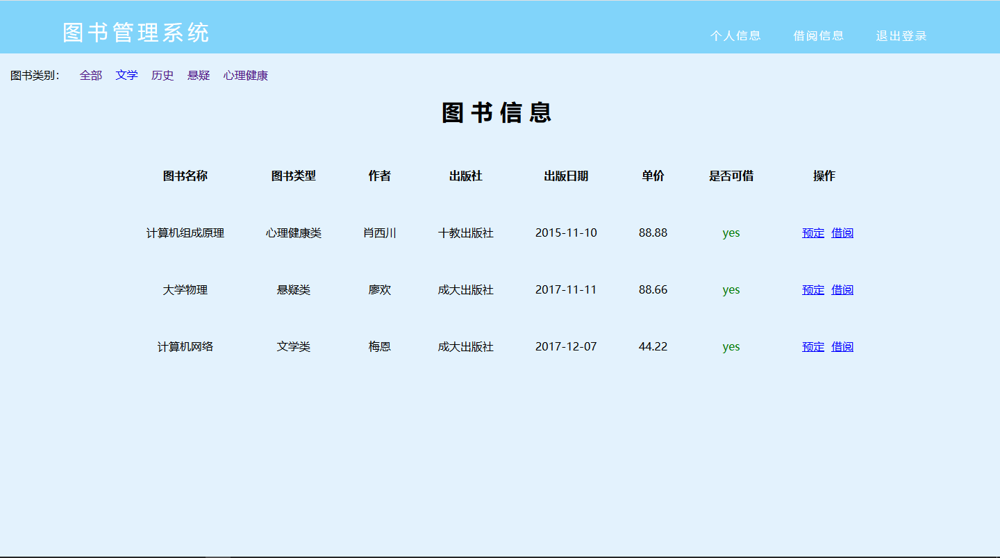
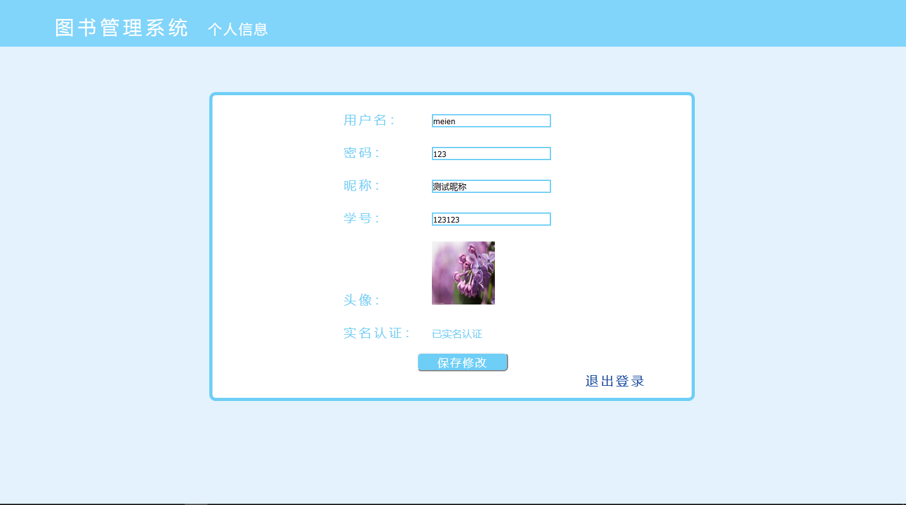
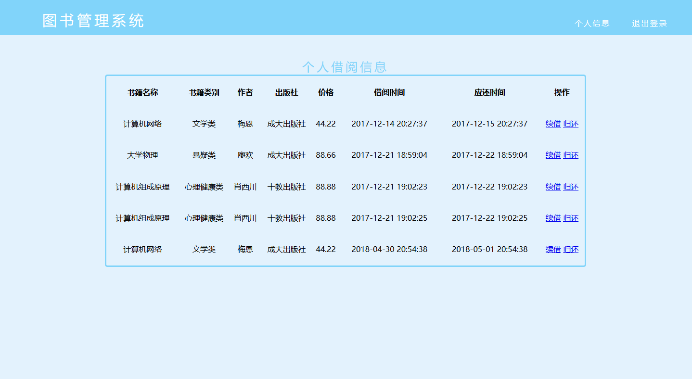
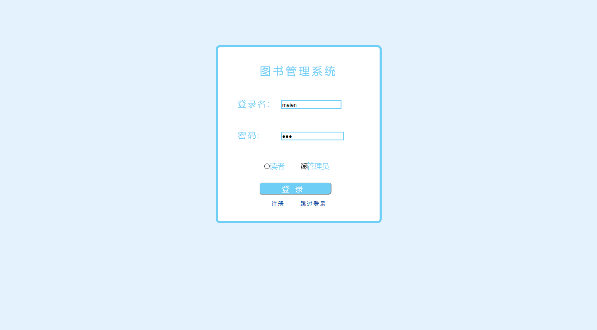
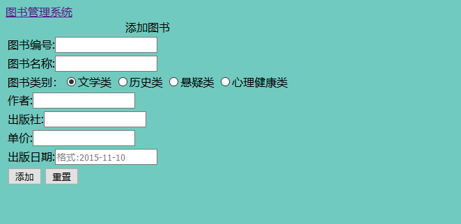
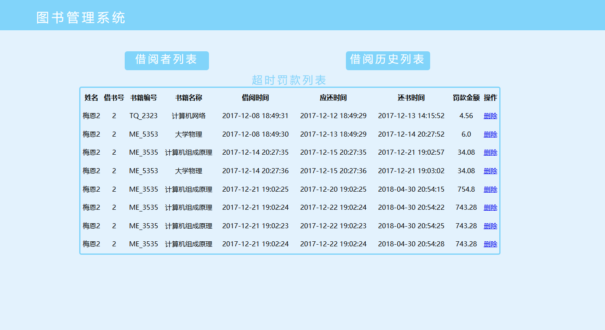

# 实验5：图书管理系统数据库设计与界面设计
|学号|班级|姓名|照片|
|:-------:|:-------------: | :----------:|:---:|
|201510414413|软件(本)15-4|梅恩||

## 1.数据库表设计

## 1.1. 图书表
|字段|类型|长度|允许空值|主键|注释|
|:-------:|:-------------:|:------:|:----:|:---:|:-----|
|book_id|char|7|否|KEY|书籍编号|
|book_name|varchar|32|否||书籍名称|
|book_type|tinyint|1|否||类型|
|author|varchar|5|是||作者|
|press|varchar|20|是||出版社|
|publish_date|date||是||出版日期|
|price|double||否||单价|
|register_time|timestamp||否||入库日期|
|is_borrow|tinyint|1|否||是否可借|

## 1.2. 读者表
|字段|类型|长度|允许空值|主键|注释|
|:-------:|:-------------:|:------:|:----:|:---:|:-----|
|id|int||否|KEY|用户id（自增）|
|account|varchar|15|否||用户名|
|password|char|32|否||密码（md5加密）|
|head_image|varchar|100|是||头像地址|
|nickname|varchar|15|是||昵称|
|sex|tinyint|1|否||性别（1男2女）|
|birthday|date||是||出生年月|
|student_id|char|11|否||学号|
|borrow_number|tinyint|1|否||已借数量（不大于5）|
|register_time|timestamp||否||注册时间|
|name|varchar|5|否||真实姓名|

## 1.3. 管理员表
|字段|类型|长度|允许空值|主键|注释|
|:-------:|:-------------:|:------:|:----:|:---:|:-----|
|sys_id|char|6|否|KEY|管理员id|
|account|varchar|15|否||用户名|
|password|char|32|否||密码（md5加密）|
|name|varchar|5|否||真实姓名|
|sex|char|1|否||性别|
|entry_time||1|否||入职时间|

## 1.4. 借阅归还表
|字段|类型|长度|允许空值|主键|注释|
|:-------:|:-------------:|:------:|:----:|:---:|:-----|
|borrow_id|int||否|KEY|读者编号|
|book_id|char|7|否|KEY|书籍编号|
|borrow_time|timestamp||否||借阅时间|
|should_r_time|timestamp||否||应还时间|
|is_return|tinyint|1|否||是否归还|
|return_time|timestamp||否||归还时间|

## 1.5. 逾期罚款表
|字段|类型|长度|允许空值|主键|注释|
|:-------:|:-------------:|:------:|:----:|:---:|:-----|
|amerce_id|int||否|KEY|逾期id（自增）|
|borrow_id|int||否||读者编号|
|name|varchar|5|否||读者真实姓名|
|book_name|varchar|15|否||书籍名称|
|book_id|char|7|否||书籍编号|
|borrow_time|datetime||否||借阅时间|
|should_r_time|datetime||否||应还时间|
|return_time|datetime||否||归还时间|
|fines|double||否||逾期金额|

***

## 2. 界面设计
## 2.1. 首页设计

- 用例图参见：图书用例
- 类图参见：图书类
- 顺序图参见：图书顺序图
- API接口如下：

1. 图书信息API

- 功能：用于获取所有图书信息
- 请求地址： http://localhost:8080/BookManagementSystem/showBooksInfo
- 请求方法：POST
- 请求参数：

|参数名称|必填|说明|
|:-------:|:-------------: | :----------:|
|book_type|是|用于确认图书类型|

- 返回实例：
```
{
    "status_code": "1/0",
    "data": 
    [
        {
            "book_id": "ME_3535",
            "book_name":"大学物理",
            "book_type":"2",
            "author":"梅恩",
            "press":"成大出版社",
            "publish_date":"2018-05-01",
            "price":"66.66",
            "register_time":"2018-05-05 20:44:44",
            "is_borrow":"3",
        },
    ]
}
```
- 返回参数说明：
    
|参数名称|说明|
|:-------:|:-------------: |
|status_code|状态码（1成功，0失败）|
|data|书籍的详细信息|

## 2.2. 个人信息页面设计

- 用例图参见：个人信息用例
- 类图参见：读者类
- 顺序图参见：读者顺序图
- API接口如下：

1. 个人信息API

- 功能：用于获取读者的个人信息
- 请求地址： http://localhost:8080/BookManagementSystem/showReaderInfo
- 请求方法：POST
- 请求参数：

|参数名称|必填|说明|
|:-------:|:-------------: | :----------:|
|borrow_id|是|读者编号|

- 返回实例：
```
{
    "status_code": "1/0",
    "data": 
    [
        {
            "account","meien",
            "password","123",
            "nickname","梅恩",
            "student_id","201510414413",
            "head_img","http://www.meien.xyz/meien.jpg"
        },
    ]
}
```
- 返回参数说明：
    
|参数名称|说明|
|:-------:|:-------------: |
|status_code|状态码（1成功，0失败）|
|data|读者的详细信息|

## 2.3. 借阅信息页面设计

- 用例图参见：借阅用例
- 类图参见：借阅类
- 顺序图参见：借阅图书顺序图
- API接口如下：

1. 借阅信息API

- 功能：用于获取读者的借阅信息
- 请求地址： http://localhost:8080/BookManagementSystem/getBorrowInfo
- 请求方法：POST
- 请求参数：

|参数名称|必填|说明|
|:-------:|:-------------: | :----------:|
|borrow_id|是|读者编号|

- 返回实例：
```
{
    "status_code": "1/0",
    "data": 
    [
        {
            "book_name","大学物理",
            "book_id","ME_2323",
            "book_type","3",
            "author","梅恩",
            "press","成大出版社",
            "price","66.66",
            "borrow_time","2018-10-10 10:10:10",
            "should_r_time","2018-11-10 10:10:10",
        },
    ]
}
```
- 返回参数说明：
    
|参数名称|说明|
|:-------:|:-------------: |
|status_code|状态码（1成功，0失败）|
|data|借阅信息的详细信息|

## 2.4. 登录页面设计

- 用例图参见：注册登录用例
- 类图参见：注册登录类
- 顺序图参见：注册登录顺序图
- API接口如下：

1. 注册登录API

- 功能：用于读者注册或者登录（包含管理员登录）
- 请求地址： http://localhost:8080/BookManagementSystem/login
- 请求方法：POST
- 请求参数：

|参数名称|必填|说明|
|:-------:|:-------------: | :----------:|
|account|是|用户名|
|password|是|密码|
|identity|否|用户身份（默认读者）|

- 返回实例：
```
{
    "status_code": "1/0"
}
```
- 返回参数说明：
    
|参数名称|说明|
|:-------:|:-------------: |
|status_code|状态码（1成功，0失败）|

## 2.5. 添加图书页面设计

- 用例图参见：图书用例
- 类图参见：图书类
- 顺序图参见：图书顺序图
- API接口如下：

1. 添加图书API

- 功能：用于管理员添加图书信息
- 请求地址： http://localhost:8080/BookManagementSystem/addBook
- 请求方法：POST
- 请求参数：

|参数名称|必填|说明|
|:-------:|:-------------: | :----------:|
|book_id|是|图书编号|
|book_name|是|图书名称|
|book_type|否|类别（默认文学类）|
|author|是|作者|
|press|是|出版社|
|price|是|单价|
|publish_time|是|出版日期|

- 返回实例：
```
{
    "status_code": "1/0"
}
```
- 返回参数说明：
    
|参数名称|说明|
|:-------:|:-------------: |
|status_code|状态码（1成功，0失败）|

## 2.6. 逾期罚款页面设计

- 用例图参见：逾期罚款用例
- 类图参见：逾期罚款类
- 顺序图参见：逾期罚款顺序图
- API接口如下：

1. 逾期罚款API

- 功能：用于获取读者逾期罚款的详细信息
- 请求地址： http://localhost:8080/BookManagementSystem/getAmerceInfo
- 请求方法：POST
- 请求参数：

|参数名称|必填|说明|
|:-------:|:-------------: | :----------:|
|borrow_id|是|读者编号|

- 返回实例：
```
{
    "status_code": "1/0",
    "data": 
    [
        {
            "amerce_id","11",
            "borrow_id","33",
            "name","梅恩",
            "book_name","犯罪心理学",
            "book_id","FZ_0001",
            "borrow_time","2018-10-10 10:10:10",
            "should_r_time","2018-11-10 10:10:10",
            "return_time","2018-12-10 10:10:10",
            "fines","22.2",
        },
    ]
}
```
- 返回参数说明：
    
|参数名称|说明|
|:-------:|:-------------: |
|status_code|状态码（1成功，0失败）|
|data|逾期罚款的详细信息|
 