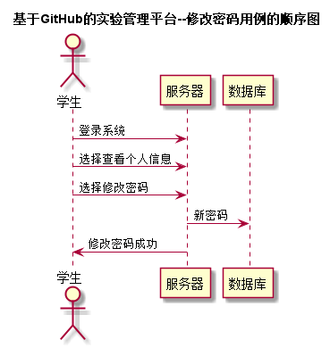


# “修改密码”用例 [返回首页](../README.md)
## 1. 用例规约

|用例名称|修改密码|
|-------|:-------------|
|功能|学生修改登录密码|
|参与者|学生|
|前置条件|学生需要先登录系统|
|后置条件| 填写新密码后需要提交|
|主事件流| 1.学生登录系统 2.查看个人信息 3.点击修改密码 4.提交新密码|
|备选事件流| |

## 2. 业务流程（顺序图） [源码](../puml/修改密码.puml)
 

## 3. 界面设计
- 界面参照: http://120.78.158.118/is_analysis/html/top.html
- API接口调用
    - 接口1：[updatePassword](../v1/api/updatePassword.md) 

## 4. 算法描述

- 学生需要登录系统后，才能执行修改密码操作
- 用户提交旧密码和新密码后，后台需要执行验证
- 如果旧密码正确，则将新密码加密后存入数据库中
- 否则提示用户修改密码失败
    
## 5. 参照表

- [student](../database.md)

