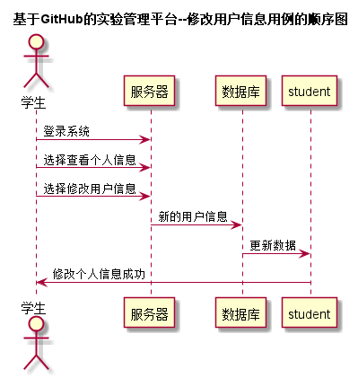

# “修改用户信息”用例 [返回首页](../README.md)
## 1. 用例规约

|用例名称|修改用户信息|
|-------|:-------------|
|功能|学生修改个人信息|
|参与者|学生，教师|
|前置条件|学生和教师需要先登录系统|
|后置条件| 填写新信息后需要提交|
|主事件流| 1.用户登录系统 2.查看个人信息 3.点击修改个人信息 4.提交新信息|
|备选事件流| |

## 2. 业务流程（顺序图） [源码](../puml/修改用户信息.puml)
 

## 3. 界面设计
- 界面参照: http://120.78.158.118/is_analysis/html/top.html
- API接口调用
    - 接口1：[updateUserInfo](../v1/api/updateUserInfo.md) 

## 4. 算法描述

- 学生需要登录系统后，才能执行修改个人信息操作
- 用户提交新的个人信息后，后台需要执行验证，判断字段格式是否符合要求
- 如果格式正确，则将新的个人信息存入数据库中
    
## 5. 参照表

- [student](../database.md)
- [teacher](../database.md)

