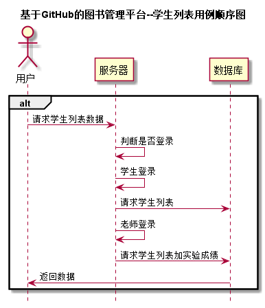


# “学生列表”用例 [返回首页](../README.md)
## 1. 用例规约

|用例名称|学生列表|
|-------|:-------------|
|功能|以表形式的显示出所有学生的信息|
|参与者|游客，学生，老师|
|前置条件|学生，老师需要先登录|
|后置条件| |
|主事件流| 1.用户在浏览器地址栏中输入本系统首页网址 2.调用getAllStudentInfo接口后显示所有学生信息|
|备选事件流|2a.如果浏览器没有响应，请刷新重试 |

## 2. 业务流程（顺序图） [源码](../puml/学生列表用例.puml)
 

## 3. 界面设计
- 界面参照: http://120.78.158.118/is_analysis/index.html
- API接口调用
    - 接口1：[getAllStudentInfo](../v1/api/getAllStudentInfo.md) 

## 4. 算法描述

- 如果用户是游客访问，则仅显示学生列表
- 如果用户是学生访问，则显示学生权限内的操作按钮
- 如果用户是老师访问，则开放全部权限
    
## 5. 参照表

- [student](../database.md)
- [course](../database.md)
- [teacher](../database.md)

