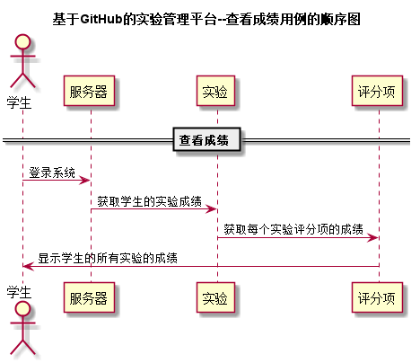


# “查看成绩”用例 [返回首页](../README.md)
## 1. 用例规约

|用例名称|查看成绩|
|-------|:-------------|
|功能|以表格的形式显示所有实验和其评分项的分数和评语|
|参与者|学生|
|前置条件|学生需要先登录，需要先选择对应的课程|
|后置条件| |
|主事件流| 1.学生登录系统 2.选择课程 3.查看实验成绩和评价|
|备选事件流| |

## 2. 业务流程（顺序图） [源码](../puml/查看成绩.puml)
 

## 3. 界面设计
- 界面参照: http://120.78.158.118/is_analysis/html/showGrade.html
- API接口调用
    - 接口1：[getProjectScore](../v1/api/getProjectScore.md) 

## 4. 算法描述

- 学生需要登录系统后，才能执行查看成绩操作
- 学生登录信息后，选择对应的课程，点击查看成绩
- 显示出对应课程所有实验的成绩和评分项的成绩及评价
    
## 5. 参照表

- [student](../database.md)
- [project](../database.md)
- [grade](../database.md)

