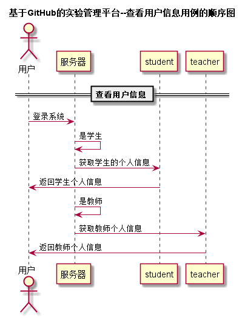


# “查看用户信息”用例 [返回首页](../README.md)
## 1. 用例规约

|用例名称|查看用户信息|
|-------|:-------------|
|功能|显示该用户的所有基本信息|
|参与者|学生，教师|
|前置条件|用户需要先登录|
|后置条件| |
|主事件流| |
|备选事件流| |

## 2. 业务流程（顺序图） [源码](../puml/查看用户信息.puml)
 

## 3. 界面设计
- 界面参照: http://120.78.158.118/is_analysis/html/showGrade.html
- API接口调用
    - 接口1：[getOneStudentInfo](../v1/api/getOneStudentInfo.md) 

## 4. 算法描述

- 
    
## 5. 参照表

- [student](../database.md)
- [teacher](../database.md)

