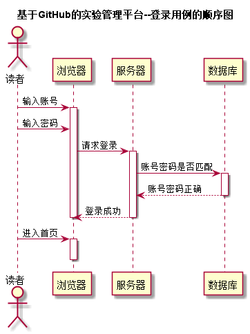


# “登录”用例 [返回首页](../README.md)
## 1. 用例规约

|用例名称|登录|
|-------|:-------------|
|功能|用户登录系统|
|参与者|学生，教师|
|前置条件||
|后置条件| 填写登录信息后提交|
|主事件流| 1.用户输入账号 2.输入密码 3.点击提交|
|备选事件流| |

## 2. 业务流程（顺序图） [源码](../puml/登录.puml)
 

## 3. 界面设计
- 界面参照: http://120.78.158.118/is_analysis/html/login.html
- API接口调用
    - 接口1：[login](../v1/api/login.md) 

## 4. 算法描述

- 用户输入账号
- 用户输入密码
- 如果从数据库中查询到对应记录，则返回成功
    
## 5. 参照表

- [student](../database.md)
- [teacher](../database.md)

