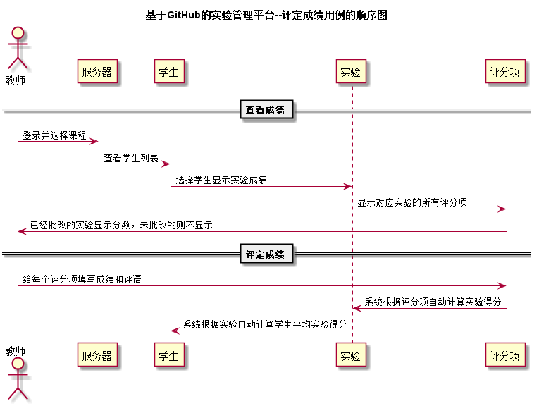


# “评定成绩”用例 [返回首页](../README.md)
## 1. 用例规约

|用例名称|评定成绩|
|-------|:-------------|
|功能|以表形式的显示出所有学生的信息|
|参与者|老师|
|前置条件|老师需要先登录，需要先选择需要评定的课程，实验|
|后置条件| 老师评定后需要点击提交按钮|
|主事件流| 1.老师登录系统 2.老师选择课程 3.老师选择学生 4.老师选择实验 5.老师选择评分项并打分填写评语 6.提交结果|
|备选事件流| |

## 2. 业务流程（顺序图） [源码](../puml/评定成绩.puml)
 

## 3. 界面设计
- 界面参照: http://120.78.158.118/is_analysis/html/grade.html
- API接口调用
    - 接口1：[setOneStudentGrade](../v1/api/setOneStudentGrade.md) 

## 4. 算法描述

- 老师需要登录系统后，才能执行评定成绩操作
- 在选择评定某个学生的成绩以后，会呈现出所有的实验以及实验的评分项
- 老师在对应的评分项下填写分数和评价后提交保存，即为评价成功
- 试验下所有的评分项都打分之后，系统会根据每个评分项的权重自动计算该实验最终分数
    
## 5. 参照表

- [student](../database.md)
- [project](../database.md)
- [grade](../database.md)
- [teacher](../database.md)

